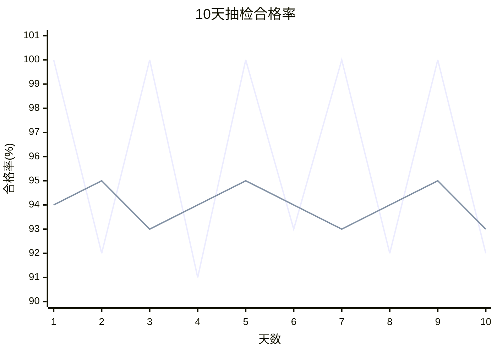

# 第1次：数学语言体检与工业决策引入

> 这是一份可直接照着讲的课堂讲稿。  
> 讲解时长：90 分钟。  
> 使用方式：从上到下顺序推进；遇到“请写下”“请回答”“停 1 分钟”就让学习者实际完成。

---

## 本节课程大纲


接着进入：


---

## 开场：今天不是为了算出唯一答案

今天这节课不从“什么是百分数、什么是均值、什么是方差”开始。

你已经接受过理工科本科教育，很多基础概念不是没有学过，而是需要重新放回真实问题里使用。今天我们只做一件事：

> 用一个完整的工业决策问题，检查数学语言能不能支持判断和行动。

请在纸上写下今天的课堂契约：

```text
这节课不是为了算出唯一答案。
这节课要练习：提出问题、读懂证据、说明边界、连接行动。
```

再写下这一句：

```text
数字不是答案本身，数字要服务于问题、判断和行动。
```

今天每一段都按同一个节奏推进：

```text
先写判断 → 看数据或图 → 解释判断为何改变 → 迁移到新问题
```

到下课时，你要能说清五件事：

1. 同一个合格率数字，在不同样本量、波动和损失结构下，为什么会指向不同决策。
2. 平均水平、稳定性、风险、成本分别在回答什么问题。
3. 图表、公式和文字结论之间如何互相转换。
4. 数据能支持什么结论，不能支持什么结论。
5. 为什么后续课程要进入概率模型、条件化思维和贝叶斯更新。

此刻你应该能说清：

```text
今天不是补公式，而是练习用数字支持判断。
```

---

## 先做判断

某材料厂有两条生产线。过去 10 天，每天抽检 100 件产品，记录当天合格件数。

> 生产线 A 的平均合格率是 96%。  
> 生产线 B 的平均合格率是 94%。  
> 生产线 B 的波动更小。  
> 企业准备扩产，应优先扩哪一条线？

请先不要计算。请在纸上写：

```text
第一次判断：A线 / B线 / 不能决定
理由：
还需要的信息：
```

停 1 分钟。

现在回答三个问题：

1. 你为什么先看平均合格率？
2. “波动更小”对你意味着什么？
3. 如果错误扩产会造成真实损失，你还需要哪三项信息？

先把三个词放在纸上：

```text
平均值：中心水平
波动：稳定程度
损失：错误行动的代价
```

如果你刚才直接选择 A 线，你默认“平均合格率”已经足够代表过程质量。  
如果你刚才直接选择 B 线，你默认“稳定性”比平均水平更重要。  
如果你刚才选择不能决定，你已经开始把数据和决策条件分开。

此刻你应该能说清：

```text
第一判断不是最终答案，它只是暴露我默认看重了什么。
```

现在打开原始数据。

---

## 打开数据

每条线每天抽检 100 件，10 天数据如下。

| 天数 | A线合格件数 | A线合格率 | B线合格件数 | B线合格率 |
|---:|---:|---:|---:|---:|
| 1 | 100 | 100% | 94 | 94% |
| 2 | 92 | 92% | 95 | 95% |
| 3 | 100 | 100% | 93 | 93% |
| 4 | 91 | 91% | 94 | 94% |
| 5 | 100 | 100% | 95 | 95% |
| 6 | 93 | 93% | 94 | 94% |
| 7 | 100 | 100% | 93 | 93% |
| 8 | 92 | 92% | 94 | 94% |
| 9 | 100 | 100% | 95 | 95% |
| 10 | 92 | 92% | 93 | 93% |
| **合计** | **960** | **96%** | **940** | **94%** |

请先看表，不计算。停 1 分钟。

现在在表里圈出四个数：

```text
A线最高：
A线最低：
B线最高：
B线最低：
```

标准结果：

```text
A线最高：100%
A线最低：91%
B线最高：95%
B线最低：93%
```

现在计算平均合格率：

```text
合格率 = 合格件数 / 抽检件数

A线平均合格率 = 960 / 1000 = 96%
B线平均合格率 = 940 / 1000 = 94%
```

再计算两种差异表达：

```text
百分点差 = 96% - 94% = 2 个百分点

相对提升 = (96% - 94%) / 94% ≈ 2.13%
```

注意：“高 2 个百分点”和“相对高 2.13%”不是同一种表达。

- “2 个百分点”是两个百分数直接相减。
- “2.13%”是差值相对于 B 线 94% 的比例。

现在改写你的判断。

```text
第二次判断：A线 / B线 / 不能决定
与第一次相比，我改变或保留判断的原因：
```

再做一个 2 分钟小检查。

某指标从 80% 提高到 84%。

请写：

```text
提高了几个百分点：
相对提高了多少：
如果基数是 5000 件，对应多少件：
```

标准计算：

```text
84% - 80% = 4 个百分点
(84% - 80%) / 80% = 5%
5000 × 4% = 200 件
```

此刻你应该能说清：

```text
A线平均更高，这是当前数据支持的结论。
但平均更高，还没有直接回答扩产选择。
```

下一步把数据换成图。

---

## 看见波动

把 10 天数据画成折线图。



图像不是装饰。图像让我们看到过程形状，而不是只看到一个平均数。

请写两句话：

```text
A线：
B线：
```

可以写成：

```text
A线：平均较高，但波动较大，最低日更低。
B线：平均较低，但波动较小，日间表现更稳定。
```

现在回答：

1. 如果只看 10 天总合格件数，哪条线有优势？
2. 如果担心某一天突然掉到 93% 以下，哪条线有优势？
3. 这两个问题是不是同一个问题？

这一段的关键结论是：

```text
同一份数据，可以回答不同问题。
问题不同，重要指标不同。
```

现在给“波动”一个数学名字。

```text
偏差 = 当天合格率 - 平均合格率

方差 = 偏差平方的平均水平

标准差 = 方差的平方根
```

为什么要平方？

因为偏差有正有负。直接相加时，正偏差和负偏差会互相抵消。平方以后，高于平均和低于平均的偏差都变成正数，波动就不会被抵消。

为什么还要标准差？

因为方差的单位被平方了，标准差把单位拉回原来的量纲，解释时更接近原数据。

写下这一句：

```text
平均值回答中心水平，标准差回答波动程度。
```

现在做一个同构练习。

两台设备 5 天故障次数如下：

| 天数 | 设备甲 | 设备乙 |
|---:|---:|---:|
| 1 | 0 | 2 |
| 2 | 0 | 2 |
| 3 | 5 | 2 |
| 4 | 0 | 2 |
| 5 | 5 | 2 |

请回答：

1. 两台设备 5 天平均故障次数分别是多少？
2. 哪台设备更稳定？
3. 如果单日故障超过 4 次会导致停线，你更担心哪台设备？

标准答案：

```text
设备甲平均故障次数 = (0+0+5+0+5)/5 = 2
设备乙平均故障次数 = (2+2+2+2+2)/5 = 2
设备乙更稳定。
如果单日故障超过 4 次会导致停线，更担心设备甲。
```

此刻你应该能说清：

```text
平均相同，不代表风险相同。
平均更高，也不代表决策一定更好。
```

---

## 想象再抽 10 天

现在做一个手动模拟，不用电脑，也不需要随机数。

请想象：如果下周再抽检 10 天，每天仍抽 100 件，你认为 A 线和 B 线一定还会保持：

```text
A线平均合格率 = 96%
B线平均合格率 = 94%
```

吗？

请先写判断：

```text
下一个10天会完全重复当前结果：会 / 不会 / 不能确定
理由：
```

现在看当前 10 天数据。A 线有 100%、92%、91%、93% 这些不同结果；B 线在 93%-95% 之间变化。

这说明两件事：

```text
短期样本会波动。
10天数据能提供证据，但不能证明长期必然如此。
```

现在请补一句：

```text
如果再抽10天，我最想观察的是：
```

可以写成：

```text
A线的低谷日是否继续出现。
B线是否仍然稳定在93%-95%之间。
A线平均优势是否能持续。
```

此刻你应该能说清：

```text
样本不是总体本身；样本是在给总体提供证据。
```

这就是后面要讲抽样波动和统计推断的入口。

---

## 加入损失

现在加入企业决策背景。

| 项目 | 数值 |
|---|---:|
| 每件合格品利润 | 20 元 |
| 每件厂内发现不合格的返工成本 | 50 元 |
| 每件流入客户现场的不合格品损失 | 5000 元 |
| 每天扩产后产量 | 10000 件 |
| 客户要求每日合格率低于 93% 必须解释原因 | 93% |

请把表里四类信息圈出来：

```text
收益
返工成本
客户现场损失
客户阈值
```

现在写下这个公式雏形：

```text
期望损失 = 发生概率 × 后果成本
```

这不是完整决策理论，只是今天要建立的直觉：

> 一件事发生的比例很低，只要后果成本足够高，也会改变决策。

现在分开两个问题：

```text
推断问题：我相信哪条线的真实过程更好？

决策问题：在利润、返工、事故和停机成本下，我应该扩哪条线？
```

请写第三次判断：

```text
第三次判断：A线 / B线 / 不能决定
如果最重视 ______，我会选择 ______，因为 ______。
```

可以这样写：

```text
如果最重视短期平均产出，我会选择 A 线，因为 A 线总合格件数更多。

如果最重视避免低谷日触发客户风险，我会选择 B 线，因为 B 线最低日表现更稳定。

如果最重视长期真实过程，我会要求更多数据，因为 10 天抽检数据不能推出长期必然表现。
```

用一张表把判断整理出来：

| 决策依据 | 重点问题 | 从当前数据得到的结论 | 还缺的信息 |
|---|---|---|---|
| 平均合格率 | 长期平均产出高不高 | A线占优 | 样本期是否代表长期过程 |
| 波动大小 | 是否稳定 | B线占优 | 波动来源是否可控 |
| 最低日表现 | 是否触发客户风险 | B线占优 | 客户阈值和处罚机制 |
| 改进潜力 | 工艺是否容易提升 | 当前数据未给出 | 调参历史、设备状态 |
| 损失结构 | 错误选择代价多大 | 取决于成本 | 返工、赔偿、停机成本 |

今天的关键句是：

```text
数据分析 = 数据 + 问题 + 损失结构 + 行动约束
```

此刻你应该能说清：

```text
推断回答我相信什么，决策回答我在损失结构下做什么。
```

---

## 把判断迁移出去

现在把生产线问题换成生活问题。

找一个“平均表现更好，但风险也更高”的例子。可以写通勤路线、投资方案、外卖配送时间，也可以写设备维护策略。

请填表：

| 项目 | 方案1 | 方案2 |
|---|---|---|
| 平均表现 |  |  |
| 最好情况 |  |  |
| 最差情况 |  |  |
| 波动大小 |  |  |
| 错误选择的损失 |  |  |
| 最终选择 |  |  |

填完以后，用一句话解释你的选择：

```text
如果最重视 ______，我选择 ______，因为 ______。
```

这一练习的目的不是找一个标准答案，而是确认你已经能把“平均、波动、损失、行动”从工业案例迁移到新问题。

此刻你应该能说清：

```text
统计思维不是只会算表里的数，而是能把同一种判断结构迁移到新场景。
```

---

## 划清边界

根据 A、B 两条生产线数据，判断以下说法是否被数据支持。

| 说法 | 判断 | 原因 |
|---|---|---|
| A线 10 天总合格件数更多 | 支持 | A线 960 件，B线 940 件 |
| B线 10 天内每日合格率更稳定 | 支持 | B线每日合格率集中在 93%-95% |
| A线长期一定比B线好 | 不支持 | 只有 10 天抽检数据，不能推出长期必然结论 |
| B线扩产后一定更赚钱 | 不支持 | 缺少成本、产能、改进潜力和长期数据 |
| 只看平均合格率即可扩产 | 不支持 | 决策还需要波动、阈值和损失结构 |

现在请你自己再写两句：

```text
当前数据支持：

当前数据不支持：
```

可以写成：

```text
当前数据支持：A线在这10天总合格件数更多，B线在这10天每日合格率更稳定。

当前数据不支持：A线长期一定更好，B线扩产后一定更赚钱，只看平均合格率即可决策。
```

再写一句更完整的结论：

```text
在当前10天抽检数据下，A线平均合格率更高，B线每日表现更稳定；扩产选择还需要结合损失结构、长期稳定性和改进潜力。
```

此刻你应该能说清：

```text
好的数据表达，必须同时说明结论和结论成立的边界。
```

---

## 连接下一课

今天我们表面上只讨论了两条生产线，实际上已经遇到整门课的主线。


今天先检查数学语言。下一步是概率模型：用模型表达不确定性。

再往后是条件化思维：新信息会改变我们讨论的对象。

然后进入贝叶斯更新：看到新证据以后，如何更新对原因、参数和模型的认识。

最后进入统计推断、因果实验和工业决策。

今天埋下三个伏笔。

### 伏笔一：概率不是抽象数字

今天的“合格率”已经是概率语言的雏形。它回答的是：

```text
在某个生产过程和检测规则下，随机抽一件产品，它合格的比例是多少？
```

### 伏笔二：信息会改变判断对象

如果只知道“来自 A 线”，我们讨论的是 A 线整体。

如果又知道“当天温度偏高”“设备刚维修”“原料批次改变”，我们讨论的已经不是原来的总体。

这就是后续“条件概率”的入口。

### 伏笔三：反推原因需要贝叶斯思维

如果某天 A 线从 100% 掉到 91%，我们会追问：

```text
是正常波动？
是设备状态变化？
是原材料批次变化？
是检测系统变化？
```

后续贝叶斯更新要解决的就是：

```text
看到结果以后，如何重新评估不同原因的可信程度？
```

现在回到 A 线第 4 天的数据。

```text
A线第4天合格率 = 91%
A线10天平均合格率 = 96%
```

只看这两个数字，我们不能立刻断言设备坏了，也不能直接说这只是普通波动。

请写下三个追问：

```text
追问1：
追问2：
追问3：
```

可以这样写：

```text
第4天是否换了原材料批次？
第4天是否有设备维修或参数调整？
第4天检测人员、检测设备或抽样方式是否改变？
```

这一步很重要。数据异常不是结论，而是追问的入口。

如果后续发现“第 4 天换了原材料批次”，我们讨论的就不再只是 A 线整体，而是：

```text
在新原材料批次条件下，A线的表现是否发生变化？
```

这就是下一阶段要讲的“条件化思维”：多知道一条信息以后，我们讨论的总体已经改变。

此刻你应该能说清：

```text
新信息会改变问题本身，也会改变我们讨论的总体。
```

---

## 收束：用三句话带走今天

请写下今天最后的三句话。

第一句，写一个数据结论：

```text
当前数据说明：
```

第二句，写一个边界说明：

```text
当前数据不能说明：
```

第三句，写一个下一课问题：

```text
下节课我想知道：
```

可以写成：

```text
当前数据说明：A线10天平均合格率更高，B线10天每日合格率更稳定。

当前数据不能说明：A线长期一定更好，也不能单独决定扩产选择。

下节课我想知道：连续5件产品都合格，是否说明这一批产品质量很好？
```

今天的核心结论是：

```text
数字从来不是单独起作用。
它必须和问题、图表、参照对象、波动、损失和行动放在一起。
```

下一次课正式进入概率模型，讨论：

```text
连续 5 件产品都合格，是否说明这一批产品质量很好？
```

---

## 本节板书总表

| 概念 | 公式或表达 | 本节含义 |
|---|---|---|
| 合格率 | `合格件数 / 抽检件数` | 单个过程的基本表现 |
| 平均合格率 | `总合格件数 / 总抽检件数` | 把多个时段合并后的总体表现 |
| 百分点 | `96% - 94% = 2 个百分点` | 两个百分数的直接差 |
| 相对变化 | `(新值 - 旧值) / 旧值` | 变化相对原水平的比例 |
| 偏差 | `观测值 - 平均值` | 每次观测偏离中心的程度 |
| 方差 | `偏差平方的平均水平` | 波动大小 |
| 标准差 | `方差的平方根` | 与原变量同量纲的波动描述 |
| 期望损失 | `发生概率 × 后果成本` | 把概率判断转成行动依据 |

---

## 延伸材料

这些材料不作为课堂前置要求，只用于课后延伸。

### 标准差图示


### 视频

- TED-Ed 统计误导案例：[How statistics can be misleading - Mark Liddell](https://ed.ted.com/lessons/how-statistics-can-be-misleading-mark-liddell)
- Harvard Stat 110 课程入口：[Statistics 110: Probability](https://stat110.hsites.harvard.edu/about)
- Harvard Stat 110 YouTube index：[Stat 110 YouTube](https://stat110.hsites.harvard.edu/youtube)

### 在线教材与参考

- GAISE College Report：[Guidelines for Assessment and Instruction in Statistics Education](https://www.amstat.org/asa/files/pdfs/gaise/gaisecollege_full.pdf)
- Berkeley Data 8：[Data 8](https://data8.org/)
- Berkeley Data 8 教材：[Computational and Inferential Thinking](https://inferentialthinking.com/)
- OpenIntro Statistics：[OpenIntro Statistics](https://www.openintro.org/book/os/)
- Introductory Statistics with Randomization and Simulation：[ISRS](https://www.openintro.org/book/isrs/)
- Seeing Theory：[Seeing Theory](https://seeing-theory.brown.edu/)
- MIT 18.05 课程大纲：[Introduction to Probability and Statistics - Syllabus](https://ocw.mit.edu/courses/18-05-introduction-to-probability-and-statistics-spring-2022/pages/syllabus/)
- 贝叶斯自然频数教学研究：[Natural frequency trees improve diagnostic efficiency](https://link.springer.com/article/10.1007/s10459-020-10025-8)
