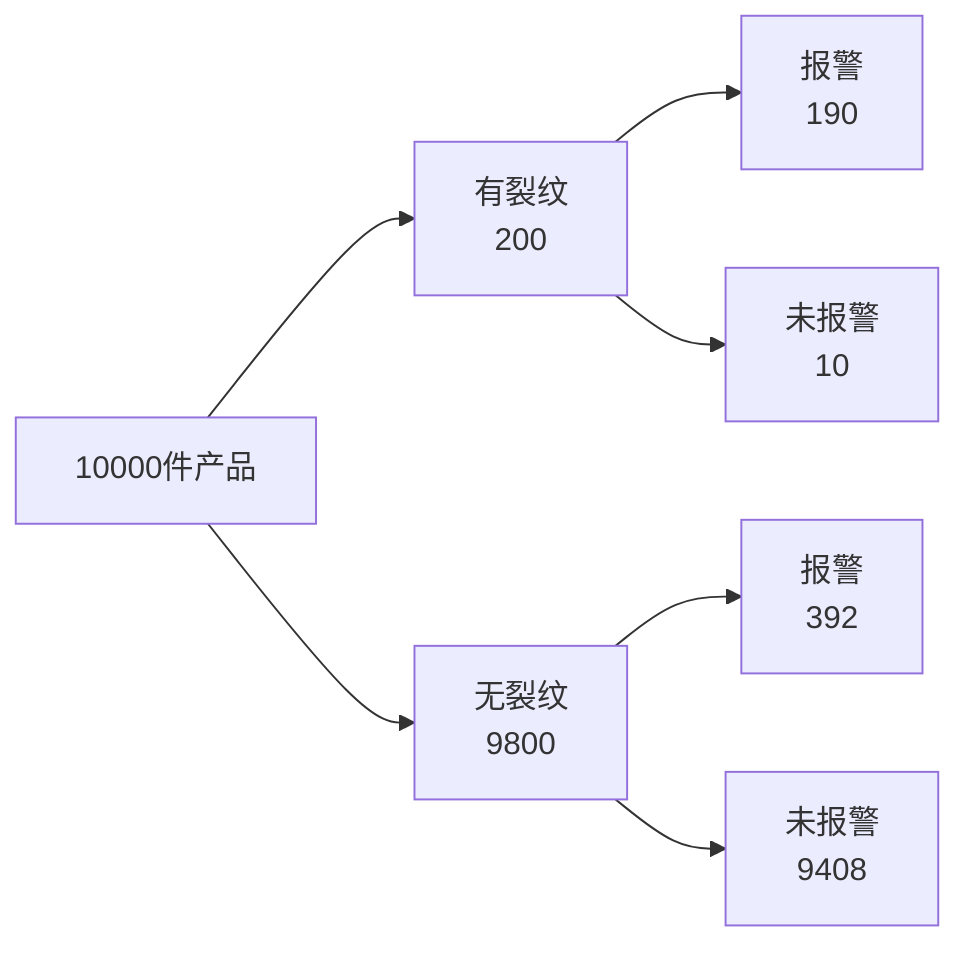

# 第3次：条件概率与信息改变对象

> 这是一份可直接照着讲的课堂讲稿。  
> 讲解时长：90 分钟。  
> 使用方式：从上到下顺序推进；遇到“请写下”“请回答”“停 1 分钟”就让学习者实际完成。  
> 本节承接第 2 次：第 2 次问“结果在模型下多常见”，本节问“增加信息后，我们讨论的对象是否已经改变”。

---

## 本节课程大纲


接着进入：


---

## 开场：条件不是附加说明

上节课我们留下了一个问题：

```text
如果连续5件合格都来自同一卷材料、同一台设备、同一个班次，
我们讨论的还是整批产品吗？
```

今天的核心句是：

```text
条件不是公式里的装饰，条件会改变讨论对象。
```

请在纸上写下今天的课堂契约：

```text
每看到一条新信息，都先问：参照总体变了吗？
```

今天要反复练习一个动作：

```text
先写原总体 -> 加入条件 -> 改写新总体 -> 再计算比例
```

此刻你应该能说清：

```text
条件概率不是先背公式，而是先换参照总体。
```

---

## 先做判断

某疾病在人群中的患病率是 1%。有一种检测方法：

```text
患病者检测阳性的比例：99%
未患病者检测阳性的比例：5%
```

现在一个人检测结果为阳性。

请先不要计算。请在纸上写：

```text
第一次判断：这个人患病可信度很高 / 不能直接判断 / 患病机会不高
理由：
我还需要的信息：
```

停 1 分钟。

现在回答：

1. 你最先注意到的是 99%，还是 1%？
2. “检测很准”这句话里，准的是哪个方向？
3. 看到阳性以后，我们讨论的是全部人，还是阳性人群？

先把两个方向写下来：

```text
P(阳性 | 患病)：患病的人里，有多少会测出阳性
P(患病 | 阳性)：阳性的人里，有多少真的患病
```

这两个方向不能互换。

此刻你应该能说清：

```text
看到结果以后，我想问的是 P(原因|结果)，但检测指标常给的是 P(结果|原因)。
```

---

## 打开人数表

先不用公式，假设有 10000 人。

患病率 1%，所以：

```text
患病人数 = 10000 × 1% = 100
未患病人数 = 9900
```

检测表现如下：

| 人群 | 人数 | 阳性比例 | 阳性人数 | 阴性人数 |
| --- | ---: | ---: | ---: | ---: |
| 患病 | 100 | 99% | 99 | 1 |
| 未患病 | 9900 | 5% | 495 | 9405 |
| 合计 | 10000 |  | 594 | 9406 |

请只看表，回答：

```text
阳性的人一共有多少：
阳性且患病的人有多少：
阳性的人里，患病比例是多少：
```

标准计算：

```text
阳性的人一共有 594 人。
阳性且患病的人有 99 人。
阳性的人里患病比例 = 99 / 594 ≈ 16.7%
```

现在把第一次判断改写：

```text
第二次判断：
我改变判断的原因：
```

注意这个结论不是说检测没有价值。

它说明：

```text
当基础患病率低时，假阳性会在阳性人群里占很大比例。
```

此刻你应该能说清：

```text
阳性结果把参照总体从10000人改成594个阳性人。
```

---

## 改写参照总体

现在专门练习“改写总体”。

请把下面三句话补完整。

```text
原问题讨论的总体：
加入条件：
新问题讨论的总体：
```

标准表达：

```text
原问题讨论的总体：全部10000人。
加入条件：检测结果为阳性。
新问题讨论的总体：594个阳性人。
```

在新总体里，我们再问：

```text
其中多少人患病？
```

这就是：

```text
P(患病 | 阳性)
```

请再练一个工业版本。

某工厂有 10000 件产品，其中 2% 存在内部裂纹。无损检测：

```text
有裂纹时报警比例：95%
无裂纹时报警比例：4%
```

请填表：

| 产品状态 | 件数 | 报警比例 | 报警件数 | 未报警件数 |
| --- | ---: | ---: | ---: | ---: |
| 有裂纹 |  | 95% |  |  |
| 无裂纹 |  | 4% |  |  |
| 合计 | 10000 |  |  |  |

标准结果：

| 产品状态 | 件数 | 报警比例 | 报警件数 | 未报警件数 |
| --- | ---: | ---: | ---: | ---: |
| 有裂纹 | 200 | 95% | 190 | 10 |
| 无裂纹 | 9800 | 4% | 392 | 9408 |
| 合计 | 10000 |  | 582 | 9418 |

现在回答：

```text
报警产品里，真实有裂纹的比例 = 190 / 582 ≈ 32.6%
```

此刻你应该能说清：

```text
检测报警会提高我对裂纹的信心，但报警不等于裂纹已经确认。
```

---

## 画成树图

把工业检测问题画成树图。



请沿着树图回答：

```text
报警路径有几条：
哪条路径是真裂纹报警：
哪条路径是假报警：
```

标准回答：

```text
报警路径有两条。
真裂纹报警：有裂纹 -> 报警，190件。
假报警：无裂纹 -> 报警，392件。
```

所以：

```text
P(有裂纹 | 报警) = 190 / (190 + 392) ≈ 32.6%
```

请在纸上写下这句话：

```text
条件概率的分母，不是全部10000件，而是符合条件的582件。
```

此刻你应该能说清：

```text
树图的作用，是把同一个结果背后的不同来源分开。
```

---

## 压缩成公式

现在把前面的表格压缩成数学表达。

条件概率定义：

```text
P(A | B) = P(A 且 B) / P(B)
```

读作：

```text
在 B 已经发生的条件下，A 发生的概率。
```

在裂纹检测问题中：

```text
A = 有裂纹
B = 报警
```

所以：

```text
P(有裂纹 | 报警) = P(有裂纹 且 报警) / P(报警)
```

用人数表达：

```text
P(有裂纹 | 报警) = 190 / 582 ≈ 32.6%
```

再写另一个方向：

```text
P(报警 | 有裂纹) = 190 / 200 = 95%
```

现在请把下面两句翻译成自然语言：

```text
P(报警 | 有裂纹)
P(有裂纹 | 报警)
```

标准表达：

```text
P(报警 | 有裂纹)：有裂纹产品中，检测报警的比例。
P(有裂纹 | 报警)：报警产品中，真实有裂纹的比例。
```

此刻你应该能说清：

```text
竖线右边是已经限定的新总体。
```

---

## 迁移到工业检测

现在换一个同构问题。

某设备有两种运行状态：

```text
正常状态：占 90%
异常状态：占 10%
```

传感器报警表现：

```text
异常状态下报警：80%
正常状态下报警：15%
```

请先写直觉判断：

```text
看到一次报警，设备是否已经异常：
第一次判断：
```

再填表。假设观察 1000 个时段。

| 状态 | 时段数 | 报警比例 | 报警时段 | 未报警时段 |
| --- | ---: | ---: | ---: | ---: |
| 异常 |  | 80% |  |  |
| 正常 |  | 15% |  |  |
| 合计 | 1000 |  |  |  |

标准结果：

| 状态 | 时段数 | 报警比例 | 报警时段 | 未报警时段 |
| --- | ---: | ---: | ---: | ---: |
| 异常 | 100 | 80% | 80 | 20 |
| 正常 | 900 | 15% | 135 | 765 |
| 合计 | 1000 |  | 215 | 785 |

现在计算：

```text
P(异常 | 报警) = 80 / 215 ≈ 37.2%
```

请改写判断：

```text
看到报警以后，我对异常的信心：
是否立刻停机：
还要补充的信息：
```

此刻你应该能说清：

```text
报警是证据，不是行动本身；下一步行动还要看损失和复检成本。
```

---

## 区分两个方向

请把下面四句话配对。

| 表达 | 自然语言 |
| --- | --- |
| `P(阳性 | 患病)` |  |
| `P(患病 | 阳性)` |  |
| `P(报警 | 异常)` |  |
| `P(异常 | 报警)` |  |

标准答案：

| 表达 | 自然语言 |
| --- | --- |
| `P(阳性 | 患病)` | 患病者中检测阳性的比例 |
| `P(患病 | 阳性)` | 阳性者中真实患病的比例 |
| `P(报警 | 异常)` | 异常状态下报警的比例 |
| `P(异常 | 报警)` | 报警以后设备真实异常的比例 |

现在写一句判断：

```text
我最容易混淆的是：
为了避免混淆，我先问：
```

参考表达：

```text
我最容易混淆的是 P(结果|原因) 和 P(原因|结果)。
为了避免混淆，我先问竖线右边限定的是哪一群对象。
```

此刻你应该能说清：

```text
条件概率的关键不是符号，而是把“在哪一群里算比例”说清。
```

---

## 划清边界

条件概率能回答：

```text
在给定条件下，某事件出现的比例是多少。
```

条件概率不能直接回答：

```text
这个条件是否导致了这个结果。
```

例子：

```text
P(异常 | 报警) 高，不等于报警导致设备异常。
P(裂纹 | 报警) 高，不等于报警导致裂纹。
P(患病 | 阳性) 高，不等于阳性导致患病。
```

请写下今天的边界句：

```text
条件概率改变参照总体，但不自动证明因果方向。
```

现在完成最终输出：

```text
数据结论：
条件改变：
边界说明：
下一步行动：
```

参考表达：

```text
数据结论：报警产品中真实有裂纹的比例约为32.6%。
条件改变：参照总体从全部产品变成报警产品。
边界说明：报警提高了裂纹判断的可信程度，但报警本身不是裂纹原因。
下一步行动：根据漏检成本、误停成本和复检成本决定是否复检、返工或停线。
```

此刻你应该能说清：

```text
条件概率是证据更新的入口，但还不是完整的反推框架。
```

---

## 连接下一课

今天我们学会了：

```text
P(结果 | 原因) 和 P(原因 | 结果) 不是一回事。
```

下一课要处理的问题是：

```text
如果我看到结果，怎样系统地反推原因？
```

这就是贝叶斯思维第一次正式出场。

请先写下下一课的问题：

```text
看到阳性、报警、不合格、失效以后，
我该怎样把先验信息和检测证据合在一起？
```

此刻你应该能说清：

```text
条件概率告诉我怎样在新总体里算比例；贝叶斯会告诉我怎样从结果反推原因。
```

---

## 收束：用三句话带走今天

第一句：一句数据结论。

```text
报警产品中真实有裂纹的比例，是190 / 582，约为32.6%。
```

第二句：一句边界说明。

```text
这个比例依赖裂纹基准率、检测灵敏度和误报警率，不能脱离这些条件单独解释。
```

第三句：一个下一课问题。

```text
看到报警以后，如何系统地反推裂纹存在的可信程度？
```

---

## 本节板书总表

| 名称 | 直观含义 | 本节表达 |
| --- | --- | --- |
| 原总体 | 没有加入条件前的对象 | 全部10000件产品 |
| 条件 | 已知信息 | 报警 |
| 新总体 | 满足条件的对象 | 582件报警产品 |
| 条件概率 | 在新总体中算比例 | `P(A|B)=P(A且B)/P(B)` |
| 敏感度 | 有问题时检出的比例 | `P(报警|裂纹)` |
| 后验方向 | 看到结果后问原因 | `P(裂纹|报警)` |
| 方向混淆 | 把两个条件方向互换 | 把95%误读成32.6% |
| 边界 | 条件概率不直接证明因果 | 报警不是裂纹原因 |

---

## 延伸材料

- Seeing Theory 条件概率可视化：[https://seeing-theory.brown.edu/](https://seeing-theory.brown.edu/)
- Berkeley Data 8：[https://inferentialthinking.com/](https://inferentialthinking.com/)
- 自然频数教学研究：[https://link.springer.com/article/10.1007/s10459-020-10025-8](https://link.springer.com/article/10.1007/s10459-020-10025-8)

这些材料用于课后延伸。课堂主体不依赖外部网页。
