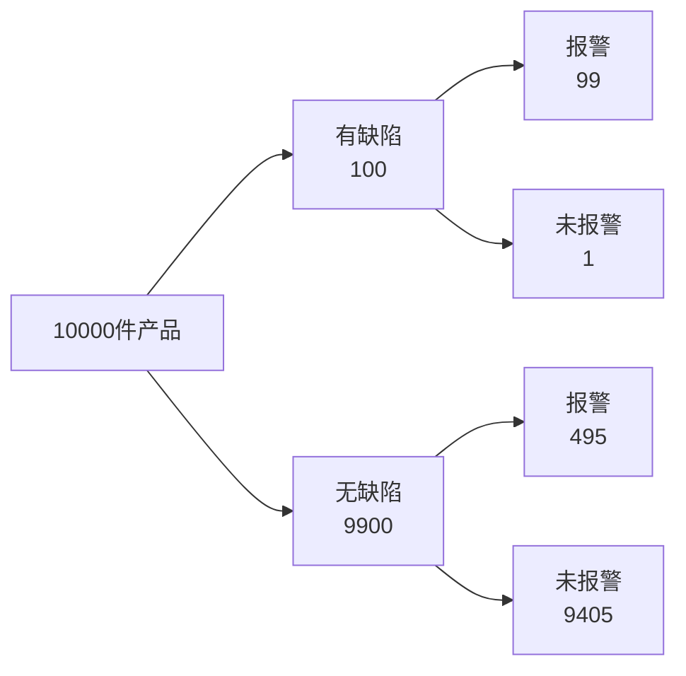

# 第4次：贝叶斯第一次，从结果反推原因

> 这是一份可直接照着讲的课堂讲稿。  
> 讲解时长：90 分钟。  
> 使用方式：从上到下顺序推进；遇到“请写下”“请回答”“停 1 分钟”就让学习者实际完成。  
> 本节承接第 3 次：第 3 次区分 `P(结果|原因)` 和 `P(原因|结果)`，本节把反推过程整理成贝叶斯框架。

---

## 本节课程大纲


接着进入：


---

## 开场：反推不能靠直觉跳步

上节课我们反复区分：

```text
P(结果 | 原因)
P(原因 | 结果)
```

今天的问题是：

```text
看到结果以后，怎样把原来的基础信息和新证据合在一起？
```

请写下今天的课堂契约：

```text
反推原因时，不能只看检测准确率，还要看原因本身有多常见。
```

今天的核心句是：

```text
后验判断 = 先验信息被新证据更新后的判断。
```

此刻你应该能说清：

```text
贝叶斯不是新公式，而是把第3次的人数表和条件概率整理成反推框架。
```

---

## 先做判断

某内部缺陷在产品中的比例为 1%。检测系统表现如下：

```text
有缺陷时，检测报警比例为 99%。
无缺陷时，检测误报警比例为 5%。
```

现在一件产品报警。

请先不要计算。请写：

```text
第一次判断：这件产品很有缺陷 / 不能直接判断 / 缺陷可信程度不高
理由：
我最先看的数字：
```

停 1 分钟。

现在回答：

1. 99% 说的是哪个方向？
2. 1% 在反推中起什么作用？
3. 5% 误报警为什么不能忽略？

先把三个词写下：

```text
先验：看结果之前，对原因的判断
似然：在某个原因下，看到这个结果的机会
后验：看到结果之后，对原因的判断
```

此刻你应该能说清：

```text
贝叶斯反推至少需要先验和似然，不能只看检测准确率。
```

---

## 用人数表

还是先不用公式。假设有 10000 件产品。

| 产品状态 | 件数 | 报警比例 | 报警件数 | 未报警件数 |
| --- | ---: | ---: | ---: | ---: |
| 有缺陷 | 100 | 99% | 99 | 1 |
| 无缺陷 | 9900 | 5% | 495 | 9405 |
| 合计 | 10000 |  | 594 | 9406 |

请回答：

```text
报警产品总数：
报警且有缺陷产品数：
报警后真实有缺陷比例：
```

标准计算：

```text
报警产品总数 = 99 + 495 = 594
报警且有缺陷产品数 = 99
P(有缺陷 | 报警) = 99 / 594 ≈ 16.7%
```

现在改写第一次判断：

```text
第二次判断：
我改变判断的原因：
```

这里的 16.7% 就是后验概率。

请写：

```text
先验：P(有缺陷)=1%
证据：报警
后验：P(有缺陷|报警)≈16.7%
```

此刻你应该能说清：

```text
报警让缺陷可信程度从1%提高到16.7%，但没有提高到99%。
```

---

## 画树图

把人数表画成树图。



看到报警以后，实际上有两条路径都通向“报警”：

```text
有缺陷 -> 报警
无缺陷 -> 报警
```

请写下：

```text
真报警人数：
假报警人数：
后验分母：
```

标准答案：

```text
真报警人数 = 99
假报警人数 = 495
后验分母 = 99 + 495 = 594
```

这就是贝叶斯反推的核心直觉：

```text
看到同一个结果，要比较不同原因通向这个结果的路径有多宽。
```

此刻你应该能说清：

```text
后验分母包含所有能产生报警的路径，不只包含真实缺陷路径。
```

---

## 整理公式

现在把树图压缩成公式。

贝叶斯公式：

```text
P(原因 | 结果) =
P(结果 | 原因) × P(原因)
/
P(结果)
```

在本例中：

```text
P(有缺陷 | 报警) =
P(报警 | 有缺陷) × P(有缺陷)
/
P(报警)
```

其中：

```text
P(报警) =
P(报警 | 有缺陷) × P(有缺陷)
+
P(报警 | 无缺陷) × P(无缺陷)
```

代入：

```text
P(有缺陷 | 报警)
= 0.99 × 0.01 / (0.99 × 0.01 + 0.05 × 0.99)
= 0.0099 / 0.0594
≈ 16.7%
```

请把这四个词配到公式里：

| 名称 | 本例含义 |
| --- | --- |
| 先验 |  |
| 似然 |  |
| 证据总概率 |  |
| 后验 |  |

标准答案：

| 名称 | 本例含义 |
| --- | --- |
| 先验 | `P(有缺陷)=1%` |
| 似然 | `P(报警|有缺陷)=99%` |
| 证据总概率 | `P(报警)=5.94%` |
| 后验 | `P(有缺陷|报警)=16.7%` |

此刻你应该能说清：

```text
贝叶斯公式是人数表的压缩，不是替代人数表的捷径。
```

---

## 迁移到缺陷检测

现在改变基准率。

同一检测系统不变：

```text
有缺陷时报警：99%
无缺陷时误报警：5%
```

但缺陷率从 1% 变成 10%。

请用 10000 件产品重新填表。

| 产品状态 | 件数 | 报警比例 | 报警件数 | 未报警件数 |
| --- | ---: | ---: | ---: | ---: |
| 有缺陷 |  | 99% |  |  |
| 无缺陷 |  | 5% |  |  |
| 合计 | 10000 |  |  |  |

标准结果：

| 产品状态 | 件数 | 报警比例 | 报警件数 | 未报警件数 |
| --- | ---: | ---: | ---: | ---: |
| 有缺陷 | 1000 | 99% | 990 | 10 |
| 无缺陷 | 9000 | 5% | 450 | 8550 |
| 合计 | 10000 |  | 1440 | 8560 |

计算后验：

```text
P(有缺陷 | 报警) = 990 / 1440 = 68.75%
```

请回答：

```text
检测系统有没有变：
报警结果有没有变：
后验为什么大幅变化：
```

标准表达：

```text
检测系统没有变。
看到的报警结果没有变。
后验变化来自先验缺陷率从1%变成10%。
```

此刻你应该能说清：

```text
同一个检测结果，在不同先验下会得到不同后验。
```

---

## 比较证据强度

现在不急着算后验，先看证据本身有多偏向缺陷。

报警这个结果在两种状态下出现的比例：

```text
P(报警 | 有缺陷) = 99%
P(报警 | 无缺陷) = 5%
```

二者之比：

```text
99% / 5% = 19.8
```

这叫似然比的直觉版本：

```text
报警这个结果，在有缺陷时出现的机会，是无缺陷时的19.8倍。
```

请注意：

```text
证据强，不代表后验一定接近100%。
```

后验还要看先验。

现在做一个课堂判断：

| 情况 | 先验缺陷率 | 报警证据强度 | 报警后判断 |
| --- | ---: | --- | --- |
| 罕见缺陷 | 1% | 强 | 后验升高但仍需复检 |
| 高风险批次 | 10% | 强 | 后验显著升高 |

请写：

```text
证据改变判断的幅度，取决于：
```

标准答案：

```text
先验有多低，以及证据对不同原因的区分能力有多强。
```

此刻你应该能说清：

```text
似然描述证据如何支持原因，后验描述证据进入后我相信什么。
```

---

## 划清边界

贝叶斯计算依赖输入。

请逐项检查：

| 输入 | 如果错了会怎样 |
| --- | --- |
| 先验缺陷率 | 后验整体偏高或偏低 |
| 报警灵敏度 | 高估或低估真缺陷报警 |
| 误报警率 | 高估或低估假报警数量 |
| 独立性与抽样方式 | 重复报警证据被重复计算 |
| 缺陷定义 | 计算对象与决策对象不一致 |

请写下今天的边界句：

```text
贝叶斯公式正确，不代表输入和模型已经正确。
```

现在完成最终输出：

```text
反推结论：
关键输入：
边界说明：
下一步行动：
```

参考表达：

```text
反推结论：在1%缺陷率、99%灵敏度和5%误报警率下，报警后真实缺陷概率约为16.7%。
关键输入：先验缺陷率、报警灵敏度、误报警率。
边界说明：该结论依赖检测系统和基准率设定。
下一步行动：根据缺陷后果和复检成本决定复检、隔离或返工。
```

此刻你应该能说清：

```text
贝叶斯更新输出的是可信程度，决策仍要引入损失结构。
```

---

## 连接下一课

前四次课都在处理事件：

```text
合格或不合格
报警或不报警
患病或未患病
有缺陷或无缺陷
```

下一课要把对象扩展成随机变量：

```text
一批产品中有多少个缺陷？
测量误差是多少？
设备寿命有多长？
关键性能指标分布在哪里？
```

下一课的核心问题是：

```text
一个概率分布到底在描述什么？
```

此刻你应该能说清：

```text
贝叶斯让事件判断被证据更新；分布让一组取值的生成机制被模型表达。
```

---

## 收束：用三句话带走今天

第一句：一句反推结论。

```text
在1%缺陷率下，一次报警后真实缺陷概率约为16.7%。
```

第二句：一句边界说明。

```text
这个后验依赖先验缺陷率、检测灵敏度和误报警率。
```

第三句：一个下一课问题。

```text
当结果不再只有有缺陷和无缺陷，而是缺陷个数、测量值和寿命时，概率模型怎样表达？
```

---

## 本节板书总表

| 名称 | 直观含义 | 本节表达 |
| --- | --- | --- |
| 先验 | 看结果前对原因的判断 | `P(缺陷)=1%` |
| 似然 | 原因成立时看到结果的机会 | `P(报警|缺陷)=99%` |
| 误报警 | 原因不成立时也看到结果 | `P(报警|无缺陷)=5%` |
| 后验 | 看到结果后对原因的判断 | `P(缺陷|报警)=16.7%` |
| 证据总概率 | 所有路径产生该结果的总比例 | `P(报警)` |
| 贝叶斯公式 | 用证据更新原因判断 | `P(原因|结果)=P(结果|原因)P(原因)/P(结果)` |
| 边界 | 结论依赖输入和模型 | 基准率、检测表现、抽样方式 |

---

## 延伸材料

- Bayes 历史资料：[https://mathshistory.st-andrews.ac.uk/SH/bayes_sh.pdf](https://mathshistory.st-andrews.ac.uk/SH/bayes_sh.pdf)
- Seeing Theory 贝叶斯可视化：[https://seeing-theory.brown.edu/](https://seeing-theory.brown.edu/)
- Harvard Stat 110：[https://stat110.hsites.harvard.edu/about](https://stat110.hsites.harvard.edu/about)

这些材料用于课后延伸。课堂主体不依赖外部网页。

